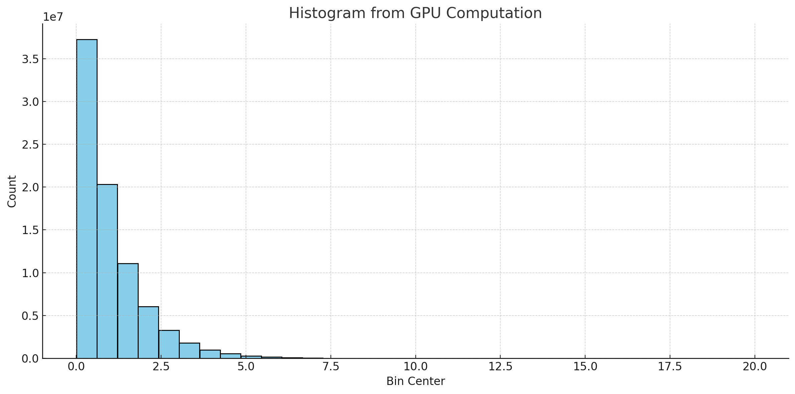
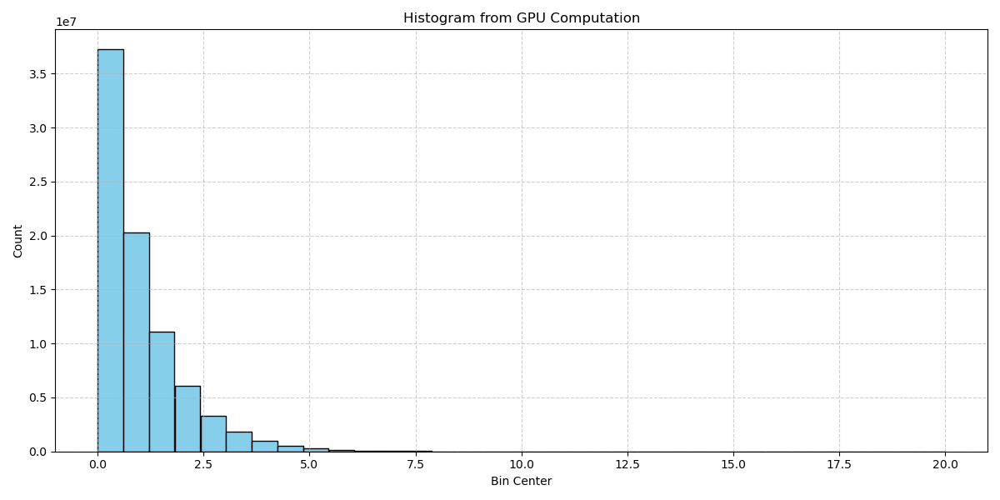

># Introduction to CUDA Parallel Programming HW5
```
Author: NTUST M11315133 陳首吉
Date: June 6, 2025
```

## Implementation

We implement two versions of the histogram kernel:

1. **Global Memory Version**: Each thread directly accesses and updates the global memory histogram.
2. **Shared Memory Version**: Each block first builds a local histogram in shared memory. After all threads in the block finish processing, the local histogram is atomically merged into the global histogram.

### Shared Memory
```cpp
__global__ void hist_smem(float *inputData, const long dataSize, unsigned int *histogram,
                          const int numBins, const float minRange, const float binWidth)
{

  // use shared memory and atomic addition

  extern __shared__ unsigned int sharedHist[]; // assume block size == numBins
  sharedHist[threadIdx.x] = 0;
  __syncthreads();

  long idx = threadIdx.x + blockIdx.x * blockDim.x;
  long step = blockDim.x * gridDim.x;

  while (idx < dataSize)
  {
    int binIndex = (int)((inputData[idx] - minRange) / binWidth);
    atomicAdd(&sharedHist[binIndex], 1);
    idx += step;
  }

  __syncthreads();
  atomicAdd(&(histogram[threadIdx.x]), sharedHist[threadIdx.x]);
}
```

#### Result



---

### Global Memory
```cpp
__global__ void hist_gmem(float *data, const long N, unsigned int *hist,
                          const int bins, const float Rmin, const float binsize)
{
    long i = threadIdx.x + blockIdx.x * blockDim.x;
    long stride = blockDim.x * gridDim.x;

    while (i < N)
    {
        int index = (int)((data[i] - Rmin) / binsize);
        if (index >= 0 && index < bins)
        {
            atomicAdd(&hist[index], 1);
        }
        i += stride;
    }
}
```

#### Result




## Dicussion

In this experiment, we computed the histogram of a data set following an exponential distribution \( f(x) = e^{-x} \) over the range \([0, 20]\), using 81,920,000 randomly generated values. We implemented and compared three versions of the histogram computation: CPU-based, GPU-based using global memory, and GPU-based using shared memory.


| Implementation           | Processing Time (ms) | Gflops    | Speedup (vs CPU) |
|--------------------------|----------------------|-----------|------------------|
| CPU                      | ~54.7                | ~2.99     | 1×               |
| GPU (shared memory)      | ~5.59                | ~29.3     | ~2.18×           |
| GPU (global memory)      | ~27.39               | ~5.98     | ~1.15×           |


- GPU acceleration significantly improves histogram computation speed, particularly when using shared memory.
- Shared memory reduces contention and enhances throughput, making it more suitable for tasks with frequent histogram updates.
- Global memory access suffers from high contention and is not ideal for histogramming unless properly optimized.
- Choosing an appropriate block size—one that aligns with the number of bins and leverages shared memory—is critical for achieving optimal performance.

