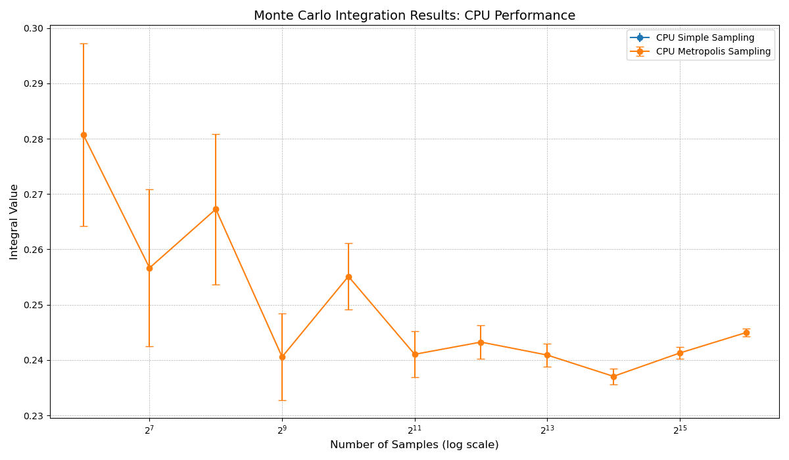
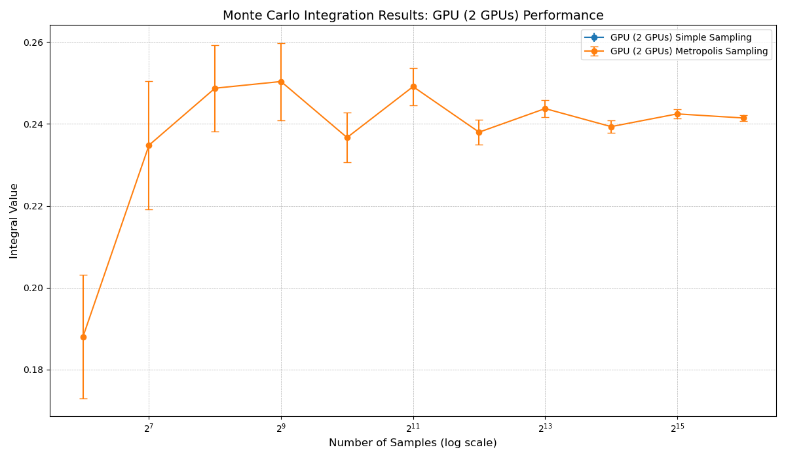

># Introduction to CUDA Parallel Programming HW7
```
Author: NTUST M11315133 陳首吉
Date: June 10, 2025
```

## Implementation

```cpp
// Simple (plain) Monte Carlo sampling
__global__ void kernel_simple_sampling(unsigned long long dnum_per_gpu,
                                       unsigned long long seed_offset,
                                       double *d_sum_f,
                                       double *d_sum_f2) {
    
    int tid = blockIdx.x * blockDim.x + threadIdx.x;
    int total_threads = gridDim.x * blockDim.x;

    curandStatePhilox4_32_10_t state;
    curand_init(
        /* seed     */ 12345ULL,
        /* subsequence */ (unsigned long long)(tid + seed_offset),
        /* offset   */ 0,
        &state);

    double x[D];

    // Loop over all dnum_per_gpu samples with stride = total_threads
    for (unsigned long long i = tid; i < dnum_per_gpu; i += total_threads)
    {
// Generate D uniform(0,1) in x[0..D-1]
        for (int j = 0; j < D; j++)
        {
            x[j] = curand_uniform_double(&state);
        }
        // Evaluate f(x)
        double fx = dev_f(x);

        // Atomically accumulate into global sums
        atomicAdd(d_sum_f, fx);
        atomicAdd(d_sum_f2, fx * fx);
    }
}
```

### CPU Implementation

*   **Simple Sampling:** Samples are generated uniformly in the 10-dimensional unit hypercube $[1]^{10}$. The integrand $f(x) = 1 / (\sum x_i^2 + 1)$ is evaluated at each sample point, and the mean and standard error are computed from these evaluations. The standard error is calculated as $\sqrt{(\langle f^2 \rangle - \langle f \rangle^2) / N}$.

*   **Metropolis Sampling with Importance:** The Metropolis algorithm is used to generate samples according to the weight function $w(x)$. A Markov chain is constructed where new points are proposed uniformly in $[1]^{10}$. The acceptance probability for a move from $x_{old}$ to $x_{new}$ is $\min(1, w(x_{new}) / w(x_{old}))$. The mean and standard error are computed based on the values of $f(x) / w(x)$ for the accepted sample points $x$. The standard error is calculated as $\sqrt{(\langle (f/w)^2 \rangle - \langle f/w \rangle^2) / N}$.

*   The program initializes the GSL random number generator with a fixed seed (12345).

*   Results are printed to standard output and saved to `results/cpu_${n}.txt`.


### GPU Implementation

*   **Multi-GPU Setup:** The program prompts the user to enter the number of GPUs in a grid (NGx, NGy) and their specific device IDs. OpenMP is used to launch parallel threads, with each thread managing one GPU. Samples are distributed among the chosen GPUs, potentially unevenly to handle the remainder.

*   **Device Functions:** The integrand `dev_f(x)` and the weight function `dev_w(x)` are implemented as device functions. The dimension `D` is hardcoded as 10.

*   **Simple Sampling Kernel (`kernel_simple_sampling`):** This kernel is launched with multiple blocks and threads per GPU. Each thread processes a subset of the total samples assigned to that GPU using a stride pattern. It generates 10 uniform random numbers per sample. The value of `dev_f(x)` is computed, and `atomicAdd` is used to accumulate the sums of $f(y)$ and $f(y)^2$ into global memory variables dedicated to each GPU. A seed offset based on the OpenMP thread ID ensures each GPU/thread combination has a distinct CURAND subsequence.

*   **Metropolis Sampling Kernel (`kernel_metropolis_sampling`):** This kernel is launched with only one thread and one block per GPU (`<<<1, 1>>>`). This means each GPU runs a single Markov chain sequentially on one thread. Within this thread, the Metropolis steps are performed: propose a new point uniformly, compute acceptance probability based on `dev_w(x)`, accept or reject the move. For accepted points, `dev_f(x_old) / dev_w(x_old)` is computed, and sums are accumulated locally. At the end of the chain, these local sums are added to per-GPU global memory variables using `atomicAdd`. A seed offset is also used for CURAND initialization.

*   Results are printed to standard output and saved to `results/mc_int_cuda.txt`. The examples show using 2 GPUs (NGx=2, NGy=1, IDs 0 and 2).

## 3. Results





The following table summarizes the results obtained from the CPU and 2-GPU runs for varying sample sizes.

| Sample Size | CPU Simple Mean +/- Std Err | CPU Metropolis Mean +/- Std Err | 2-GPU Simple Mean +/- Std Err | 2-GPU Metropolis Mean +/- Std Err |
| :---------- | :-------------------------- | :------------------------------ | :---------------------------- | :-------------------------------- |
| 64          | 0.2433460876 +/- 0.0078553274 | 0.2807200873 +/- 0.0165590477 | 0.2304269615 +/- 0.0049197224 | 0.1880286587 +/- 0.0150615110 |
| 128         | 0.2410459557 +/- 0.0049937342 | 0.2566480782 +/- 0.0142260322 | 0.2397783818 +/- 0.0043772027 | 0.2348061735 +/- 0.0156171421 |
| 256         | 0.2426488470 +/- 0.0034112118 | 0.2672635433 +/- 0.0136273161 | 0.2388921592 +/- 0.0034523545 | 0.2487237386 +/- 0.0105379406 |
| 512         | 0.2419165121 +/- 0.0023873955 | 0.2405665575 +/- 0.0078167590 | 0.2368370041 +/- 0.0025406600 | 0.2503585260 +/- 0.0094391330 |
| 1024        | 0.2422326972 +/- 0.0017261567 | 0.2551172973 +/- 0.0059892613 | 0.2407824200 +/- 0.0018252461 | 0.2366761328 +/- 0.0060554123 |
| 2048        | 0.2418403191 +/- 0.0012322096 | 0.2410371724 +/- 0.0041685550 | 0.2403446562 +/- 0.0012815600 | 0.2491118311 +/- 0.0045840943 |
| 4096        | 0.2430801782 +/- 0.0009064810 | 0.2432462583 +/- 0.0030005077 | 0.2421145465 +/- 0.0009202319 | 0.2379861978 +/- 0.0030157272 |
| 8192        | 0.2429043251 +/- 0.0006418727 | 0.2409042874 +/- 0.0020957798 | 0.2425178649 +/- 0.0006479466 | 0.2437473507 +/- 0.0021426485 |
| 16384       | 0.2427942501 +/- 0.0004555370 | 0.2370569428 +/- 0.0014442342 | 0.2419206811 +/- 0.0004458936 | 0.2393421145 +/- 0.0014713672 |
| 32768       | 0.2428654136 +/- 0.0003212994 | 0.2412688709 +/- 0.0010412454 | 0.2425432653 +/- 0.0003189360 | 0.2424514759 +/- 0.0010548394 |
| 65536       | 0.2428515648 +/- 0.0002280211 | 0.2449622866 +/- 0.0007509537 | 0.2428039836 +/- 0.0002287552 | 0.2414543091 +/- 0.0007377633 |

## Discussion
Monte Carlo integration for the 10-dimensional integral was successfully implemented on both CPU and a multi-GPU system. Both Simple Sampling and Metropolis Importance Sampling algorithms were used. The results show that the computed integral value converges with increasing sample size, and the standard error decreases as expected. The CPU and GPU implementations produced consistent statistical results. The design of the GPU code uses distinct parallel strategies for Simple Sampling (many threads per GPU) and Metropolis Sampling (one thread per GPU, multiple chains across GPUs), which would have different performance characteristics (though performance times were not available in the sources). While importance sampling with the chosen weight function did not significantly reduce variance compared to simple sampling in these tests, the implementation provides a framework for exploring high-dimensional integration on parallel hardware.
