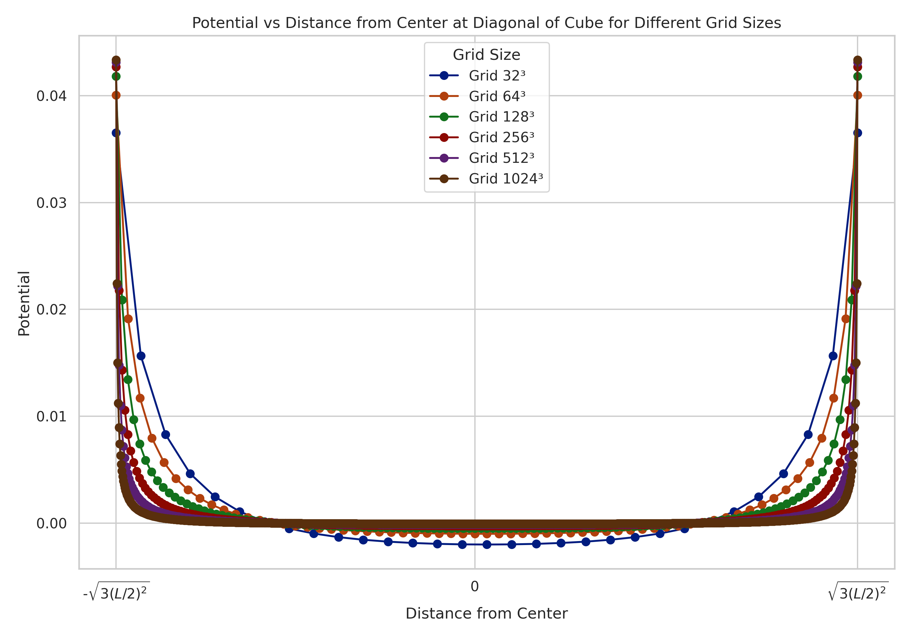

># Introduction to CUDA Parallel Programming HW9
```
Author: NTUST M11315133 陳首吉
Date: June 10, 2025
```

## Lattice Sizes from 32 to 1024



To evaluate the convergence and scalability of our approach, we extended the test to larger lattice sizes: `32`, `64`, `128`, `256`, `512`, and `1024`. Note that `1024³` is the largest grid size that can fit within the memory constraints of an NVIDIA RTX 4090.

From these figures, we observe that the numerical solution becomes smoother and more continuous as the lattice size increases. This indicates convergence toward the true continuous-space solution. Larger grids provide better spatial resolution, resulting in more accurate approximation of the Green's function in 3D.

## Conclusion

The numerical method using cuFFT shows good agreement with the expected physical behavior of the 3D Poisson equation. The approach is efficient and easily scalable on modern GPUs. As lattice resolution increases, the computed potentials converge, reinforcing the correctness and effectiveness of this Fourier-based method.

